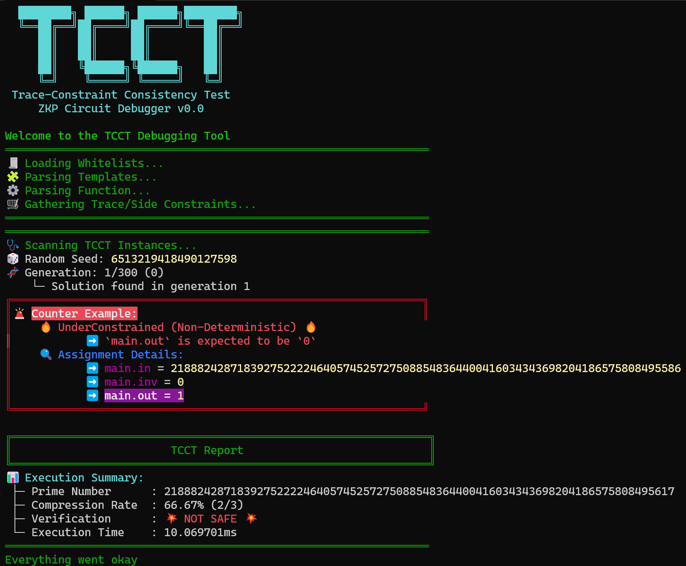
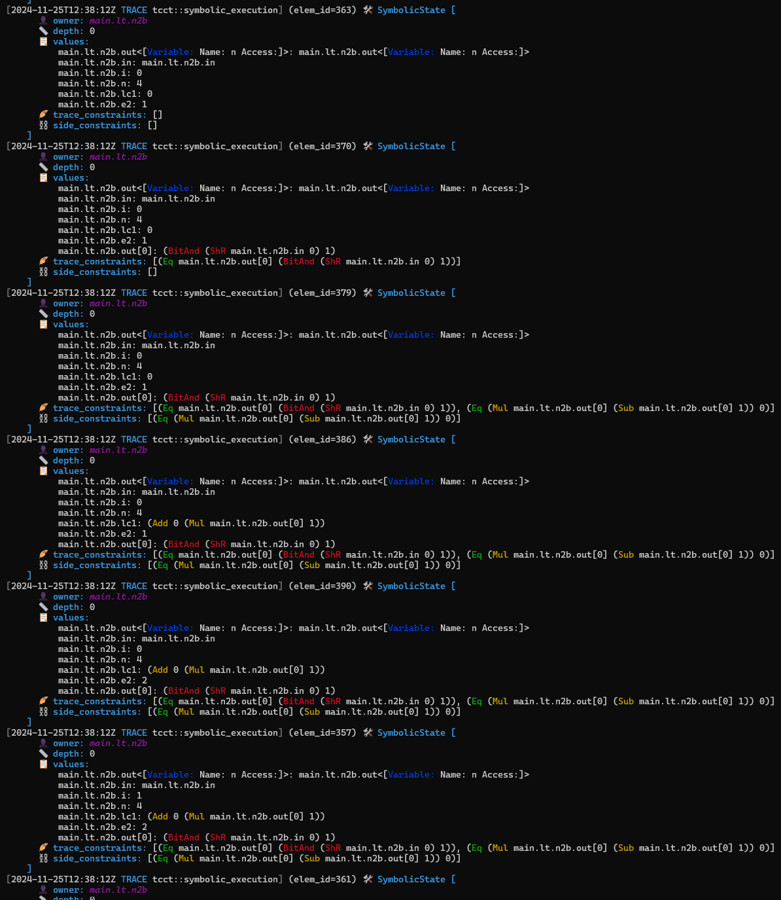
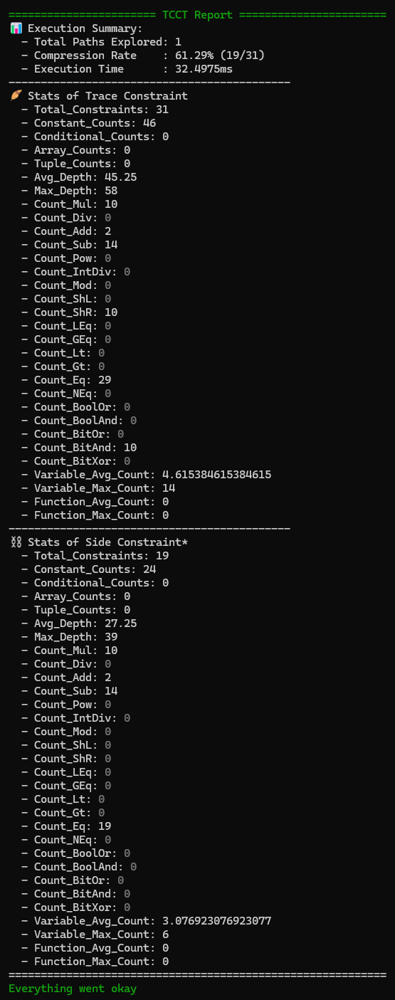

# ProoFuzz

**ProoFuzz** is a ZKP circuit fuzzer designed to help you identify vulnerabilities in zero-knowledge proof circuits. It leverages mutation testing to uncover counterexamples that reveal under-constrained or over-constrained behavior in your circuits.

## Build

To compile the tool, run:

```bash
cargo build --release
```

## Basic Usage

ProoFuzz’s CLI provides numerous options to tailor your fuzzing session. Below is a summary of the available commands and flags:

```
ZKP Circuit Fuzzer

USAGE:
    proofuzz [FLAGS] [OPTIONS] [--] [input]

FLAGS:
        --constraint_assert_dissabled    Does not add asserts in the generated code for === constraint equalities
        --lessthan_dissabled             (ProoFuzz) Does not detect overflow erros due to LessThan template
        --print_ast                      (ProoFuzz) Prints AST
        --show_stats_of_ast              (ProoFuzz) Prints the basic stats of AST
        --print_stats                    (ProoFuzz) Prints the stats of constraints
        --print_stats_csv                (ProoFuzz) Prints the stats of constraints in CSV format
        --symbolic_template_params       (ProoFuzz) Treats the template parameters of the main template as symbolic values
        --save_output                    (ProoFuzz) Save the output when the counterexample is found
    -h, --help                           Prints help information
    -V, --version                        Prints version information

OPTIONS:
    -l <link_libraries>                  Adds directory to library search path
    -p, --prime <prime>
            To choose the prime number to use to generate the circuit. Receives the name of the curve (bn128, bls12381,
            goldilocks, grumpkin, pallas, vesta, secq256r1) [default: bn128]
        --debug_prime <debug_prime>
            (ProoFuzz) Prime number for ProoFuzz [default:
            21888242871839275222246405745257275088548364400416034343698204186575808495617]
        --search_mode <search_mode>
            (ProoFuzz) Search mode to find the counter example that shows the given circuit is not well-constrained [default: ga]
        --heuristics_range <heuristics_range>
            (ProoFuzz) Heuristics range for ProoFuzz [default: 100]
        --path_to_mutation_setting <path_to_mutation_setting>
            (ProoFuzz) Path to the setting file for Mutation Testing [default: none]
        --path_to_whitelist <path_to_whitelist>                  
            (ProoFuzz) Path to the white-lists file [default: none]

ARGS:
    <input>    Path to a circuit with a main component [default: ./circuit.circom]
```

**Example Command:**

Run ProoFuzz using your circuit file written in Circom:

```bash
# Using the debug build:
./target/debug/proofuzz ./tests/sample/iszero_vuln.circom

# Using the release build:
./target/release/proofuzz ./tests/sample/iszero_vuln.circom
```

**Example Output:**



## Mutation Testing

Mutation testing (`ga` mode) suppots a detailed configuration through the `path_to_mutation_setting` option. The configuration is specified as a JSON file.

### Schema Overview

Here is an example of the JSON configuration schema:

```json
{
    "seed": 0,
    "program_population_size": 30,
    "input_population_size": 30,
    "max_generations": 300,
    "input_initialization_method": "random",
    "trace_mutation_method": "constant",
    "fitness_function": "error",
    "mutation_rate": 0.3,
    "crossover_rate": 0.5,
    "operator_mutation_rate": 0.2,
    "num_eliminated_individuals": 5,
    "max_num_mutation_points": 10,
    "input_update_interval": 1,
    "input_generation_max_iteration": 30,
    "input_generation_crossover_rate": 0.66,
    "input_generation_mutation_rate": 0.5,
    "input_generation_singlepoint_mutation_rate": 0.5,
    "random_value_ranges": [
        [   "-10", 
            "10"
        ],
        [
            "21888242871839275222246405745257275088548364400416034343698204186575808495517", 
            "21888242871839275222246405745257275088548364400416034343698204186575808495617"
        ]
    ],
    "random_value_probs": [
        0.5,
        0.5
    ],
    "save_fitness_scores": false
}
```

If the configuration json file ommites some keys, the default values are used for those omiited keys.

### Field Descriptions

```yaml
- seed (u64)
    - Purpose: Seed for random number generation to ensure reproducibility. If set to 0, a new seed is internally generated using the thread-local random number generator.
    - Default: `0`

- program_population_size (usize)
    - Purpose: Size of the program population in the genetic algorithm.
    - Default: `30`

- input_population_size (usize)
    - Purpose: Size of the input population in the genetic algorithm.
    - Default: `30`

- max_generations (usize)
    - Purpose: Maximum number of generations for the evolutionary process.
    - Default: `300`

- input_initialization_method (String)
    - Purpose: Method used to initialize inputs (`random`, `coverage`).
    - Default: `"random"`

- trace_mutation_method (String)
    - Purpose: Method used for trace mutation (`constant`, `constant_operator`).
    - Default: `"constant_operator"`

- fitness_function (String)
    - Purpose: Function used to evaluate fitness of solutions.
    - Default: `"error"`

- mutation_rate (f64)
    - Purpose: Rate at which mutations occur in the genetic algorithm.
    - Default: `0.3`

- crossover_rate (f64)
    - Purpose: Rate at which crossover occurs in the genetic algorithm.
    - Default: `0.5`

- operator_mutation_rate (f64)
    - Purpose: Rate of mutation for operators in the genetic algorithm.
    - Default: `0.2`

- num_eliminated_individuals (usize)
    - Purpose: The number of individuals with poor fitness eliminated in each generation.
    - Default: `5`

- max_num_mutation_points (usize)
    - Purpose: The maximum number of mutation points allowed in the symbolic trace.
    - Default: `10`

- input_update_interval (usize)
    - Purpose: Interval at which inputs are updated.
    - Default: `1`

- input_generation_max_iteration (usize)
    - Purpose: Maximum number of iterations for input generation.
    - Default: `30`

- input_generation_crossover_rate (f64)
    - Purpose: Crossover rate for input generation.
    - Default: `0.66`

- input_generation_mutation_rate (f64)
    - Purpose: Mutation rate for input generation.
    - Default: `0.5`

- input_generation_singlepoint_mutation_rate (f64)
    - Purpose: Single-point mutation rate for input generation.
    - Default: `0.5`

- random_value_ranges (Array of Arrays)
    - Purpose: Ranges for random value generation.
    - Format: Array of pairs of strings representing big integers.
    - Default: `[["-10", "10"], ["21888242871839275222246405745257275088548364400416034343698204186575808495517", "21888242871839275222246405745257275088548364400416034343698204186575808495617"]]`

- random_value_probs (Array of f64)
    - Purpose: Probabilities associated with random value ranges.
    - Default: `[0.5, 0.5]`

- binary_mode_prob (f64)
    - Purpose: Probability of restricting random input to only 0 or 1.
    - Default: `0.0`

- binary_mode_search_level (usize)
    - Purpose: Search depth for the binary pattern (x * (1 - x) === 0) check.
    - Default: 1

- binary_mode_warmup_round (f64)
    - Purpose: Ratio of warmup rounds where binary_mode_prob is temporarily set to 1 upon detecting the binary pattern.
    - Default: 0.1

- zero_div_attempt_prob (f64)
    - Purpose: Probability of invoking the quadratic equation solver to analytically determine solutions for zero-division patterns.
    - Default: 0.2

- save_fitness_scores (bool)
    - Purpose: Flag to determine if fitness scores should be saved.
    - Default: `false`
```

## Tips & Advanced Features

### Saving Output

When the `--save_output` option is enabled, the counterexample is saved to the directory when found.

**Example Command with `--save_output`**

```bash
./target/release/proofuzz ./tests/sample/test_vuln_iszero.circom --search_mode="ga" --save_output
```

The output filename will follow the pattern `<TARGET_FILE_NAME>_<RANDOM_SUFFIX>_counterexample.json`.

**Example Output:**

```json
{
  "0_target_path": "./tests/sample/test_vuln_iszero.circom",
  "1_main_template": "VulnerableIsZero",
  "2_search_mode": "ga",
  "3_execution_time": "36.3001ms",
  "4_git_hash_of_proofuzz": "106b20ddad6431d0eee3cd73f9aac0153af4bbd9",
  "5_flag": {
    "1_type": "UnderConstrained-NonDeterministic",
    "2_expected_output": {
      "name": "main.out",
      "value": "0"
    }
  },
  "6_target_output": "main.out",
  "7_assignment": {
    "main.in": "21888242871839275222246405745257275088548364400416034343698204186575808495524",
    "main.inv": "0",
    "main.out": "1"
  },
  "8_auxiliary_result": {
    "mutation_test_config": {
      "crossover_rate": 0.5,
      "fitness_function": "error",
      "input_generation_crossover_rate": 0.66,
      "input_generation_max_iteration": 30,
      "input_generation_mutation_rate": 0.5,
      "input_generation_singlepoint_mutation_rate": 0.5,
      "input_initialization_method": "random",
      "input_population_size": 30,
      "input_update_interval": 1,
      "max_generations": 300,
      "mutation_rate": 0.3,
      "operator_mutation_rate": 0.2,
      "program_population_size": 30,
      "random_value_probs": [
        0.5,
        0.5
      ],
      "random_value_ranges": [
        [
          "-10",
          "10"
        ],
        [
          "21888242871839275222246405745257275088548364400416034343698204186575808495517",
          "21888242871839275222246405745257275088548364400416034343698204186575808495617"
        ]
      ],
      "save_fitness_scores": false,
      "seed": 0,
      "trace_mutation_method": "constant"
    },
    "mutation_test_log": {
      "fitness_score_log": [],
      "generation": 7,
      "random_seed": 13057132941229430025
    }
  }
}
```

### Logging

ProoFuzz offers multiple verbosity levels for detailed analysis with the environmental variable `RUST_LOG`:

- `warn`: Outputs warnings and errors.
- `info`: Includes everything from `warn` and adds the basic statistics about the trace and constraints.
- `debug`: Includes everything from `info` and adds the trace of the final state.
- `trace`: Includes everything from `debug` and outputs all intermediate trace states during execution.

**Example Command with Verbosity:**

```bash
RUST_LOG=trace ./target/debug/proofuzz ../sample/lessthan3.circom --print_ast --print_stats
```

**Example Output:**

<div style="display: flex; align-items: flex-start; justify-content: space-around;">
  
  
  
</div>

