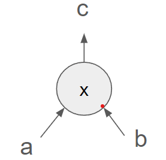

# Basic of Circom

## Typical ZKP Workload (with Circom)


1. The prover designs the circuit using Circom, a domain-specific language for zkSNARKs.
2. The Circom compiler translates the high-level circuit description into a low-level description.
    - R1CS that represents the circuit's constraints.
    - Witness generation program that does the actual calculation.
3. A trusted party generates the proving and verification keys specific to the circuit.
4. The prover inputs both public and private data into the compiled circuit and uses the proving key to generate a zero-knowledge proof.
5. The verifier uses the verification key to check the validity of the proof without learning the private inputs.

### Internal of Circom: Constraint Generation

Circom compiles the high-level arithmetic circuit specification into R1CS (Rank-1 Constraint System), representing arithmetic circuits as matrix equations. 

1. Statement: “c === a * b"

2. Arithmetic Circuit:



3. R1CS
   
```
    c a b   element-wise product
    ↓ ↓ ↓         ↓
([0,0,1,0] · w^T) ○ ([0,0,0,1] · w^T) - ([0,1,0,0] · w^T) = 0
```


#### Example

```c++
pragma circom 2.1.6;
template Multiply() {
  signal input a;
  signal input b;
  signal output out;
  //Assign & Constraint
  out <== a * b;
}
component main = Multiply();
```

We can convert the above circuit written in circom with the following command:

```bash
$ circom multiply.circom --r1cs --sym -o build

template instances: 1
non-linear constraints: 1
linear constraints: 0
public inputs: 0
private inputs: 2
public outputs: 2
wires: 4
labels: 4
Written successfully: build/multiply.r1cs
Written successfully: build/multiply.sym
```

We can also debug the constraints within the r1cs file with the following command:

```bash
$  snarkjs r1cs print build/multiply.r1cs
[INFO]  snarkJS: [ 21888242871839275222246405745257275088548364400416034343698204186575808495616main.a ] * [ main.b ] - [ 21888242871839275222246405745257275088548364400416034343698204186575808495616main.out ] = 0
```

Note that the default prime number of circom is `21888242871839275222246405745257275088548364400416034343698204186575808495617`. Thus, the above equation can be viewed as `-a*b - (-out) = 0`, which is equivalent to `a*b - out = 0`.

