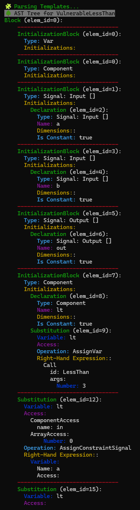

# Trace-Constraint Consistency Test (TCCT)

This tool is designed to extract and analyze the trace constraints ($`\mathcal{T}(\mathcal{P})`$) and side constraints ($`\mathcal{S}(\mathcal{C})`$) from ZKP circuits written in Circom.

## Build

To compile the tool, run:

```bash
cargo build
```

## Usage

```
USAGE:
    tcct [FLAGS] [OPTIONS] [--] [input]

FLAGS:
        --print_ast                          (TCCT) Prints AST
        --print_stats                        (TCCT) Prints the stats of constraints
        --symbolic_template_params           (TCCT) Treats the template parameters of the main template as symbolic values
        --propagate_substitution             (TCCT) Propagate variable substitution as much as possible
OPTIONS:
        --search_mode <search_mode>          (TCCT) Search mode to find the counter example that shows the given circuit
                                                    is not well-constrained [default: none]
        --debug_prime <debug_prime>          (TCCT) Prime number for TCCT debugging [default:
                                                    21888242871839275222246405745257275088548364400416034343698204186575808495617]
ARGS:
    <input>    Path to a circuit with a main component [default: ./circuit.circom]
```

**Example command:**

```bash
RUST_LOG=info ./target/release/tcct ../sample/iszero_vuln.circom --search_mode="quick"
```

**Example output:**

```bash

  ████████╗ ██████╗ ██████╗████████╗
  ╚══██╔══╝██╔════╝██╔════╝╚══██╔══╝
     ██║   ██║     ██║        ██║
     ██║   ██║     ██║        ██║
     ██║   ╚██████╗╚██████╗   ██║
     ╚═╝    ╚═════╝ ╚═════╝   ╚═╝
 Trace-Constraint Consistency Test
     ZKP Circuit Debugger v0.0

Welcome to the TCCT Debugging Tool
════════════════════════════════════════════════════════════════
🧩 Parsing Templates...
⚙️ Parsing Function...
🛒 Gathering Trace/Side Constraints...
════════════════════════════════════════════════════════════════
[2024-12-06T18:04:58Z INFO  tcct] Final State: 🛠️ SymbolicState [
      👤 owner: "main"
      📏 depth: 0
      📋 values:
          main.in: main.in
          main.out: (Add (Mul (Minus main.in) 0) 1)
          main.inv: 0
      🪶 trace_constraints: (BoolNot (NEq main.in 0)), (Eq main.inv 0), (Eq main.out (Add (Mul (Minus main.in) 0) 1)), (Eq (Mul main.out (Sub main.out 1)) 0)
      ⛓️ side_constraints: (BoolNot (NEq main.in 0)), (Eq main.out (Add (Mul (Minus main.in) 0) 1)), (Eq (Mul main.out (Sub main.out 1)) 0)
    ]

[2024-12-06T18:04:58Z INFO  tcct] Final State: 🛠️ SymbolicState [
      👤 owner: "main"
      📏 depth: 0
      📋 values:
          main.in: main.in
          main.out: (Add (Mul (Minus main.in) main.inv) 1)
          main.inv: (Div 1 main.in)
      🪶 trace_constraints: (NEq main.in 0), (Eq main.inv (Div 1 main.in)), (Eq main.out (Add (Mul (Minus main.in) main.inv) 1)), (Eq (Mul main.out (Sub main.out 1)) 0)
      ⛓️ side_constraints: (NEq main.in 0), (Eq main.out (Add (Mul (Minus main.in) main.inv) 1)), (Eq (Mul main.out (Sub main.out 1)) 0)
    ]

════════════════════════════════════════════════════════════════
🩺 Scanning TCCT Instances...
Progress: 27 / 21888242871839275222246405745257275088548364400416034343698204186575808495617^3
 • Search completed
     ├─ Total iterations: 27
     └─ Verification result: ✅ WellConstrained ✅
Progress: 13 / 21888242871839275222246405745257275088548364400416034343698204186575808495617^3
 • Search completed
     ├─ Total iterations: 13
     └─ Verification result: 🔥 UnderConstrained 🔥
╔══════════════════════════════════════════════════════════════╗
║🚨 Counter Example:                                           ║
║    🔥 UnderConstrained 🔥
║    🔍 Assignment Details:
║           ➡️ main.in = 1
║           ➡️ main.out = 1
║           ➡️ main.inv = 0
╚══════════════════════════════════════════════════════════════╝

╔═══════════════════════════════════════════════════════════════╗
║                        TCCT Report                            ║
╚═══════════════════════════════════════════════════════════════╝
📊 Execution Summary:
 ├─ Prime Number      : 21888242871839275222246405745257275088548364400416034343698204186575808495617
 ├─ Total Paths       : 2
 ├─ Compression Rate  : 71.43% (5/7)
 ├─ Verification      : 💥 NOT SAFE 💥
 └─ Execution Time    : 511.6µs
════════════════════════════════════════════════════════════════
Everything went okay
```

This tool also provides multiple verbosity levels for detailed analysis:

- `warn`: Outputs warnings and basic statistics about the trace and side constraints.
- `info`: Includes everything from `warn` and adds details about all possible finite states.
- `debug`: Includes everything from `info` and adds the full AST (Abstract Syntax Tree).
- `trace`: Includes everything from `debug` and outputs all intermediate trace states during execution.

**Example Command with Verbosity:**

```bash
RUST_LOG=trace ./target/debug/tcct ../sample/lessthan3.circom --print_ast --print_stats
```

**Example output:**

<div style="display: flex; align-items: flex-start; justify-content: space-around;">
  
  
  
</div>


